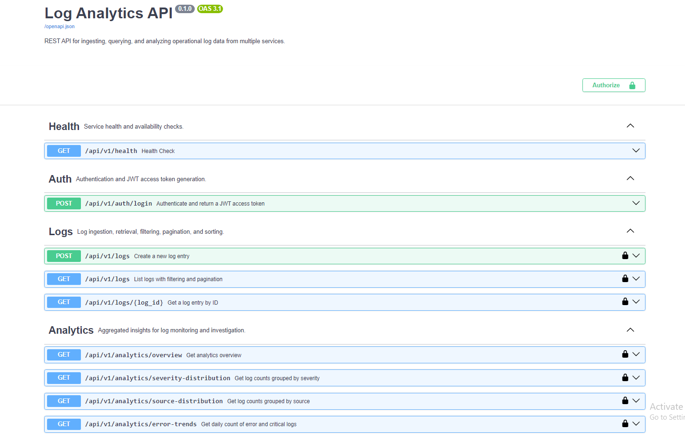
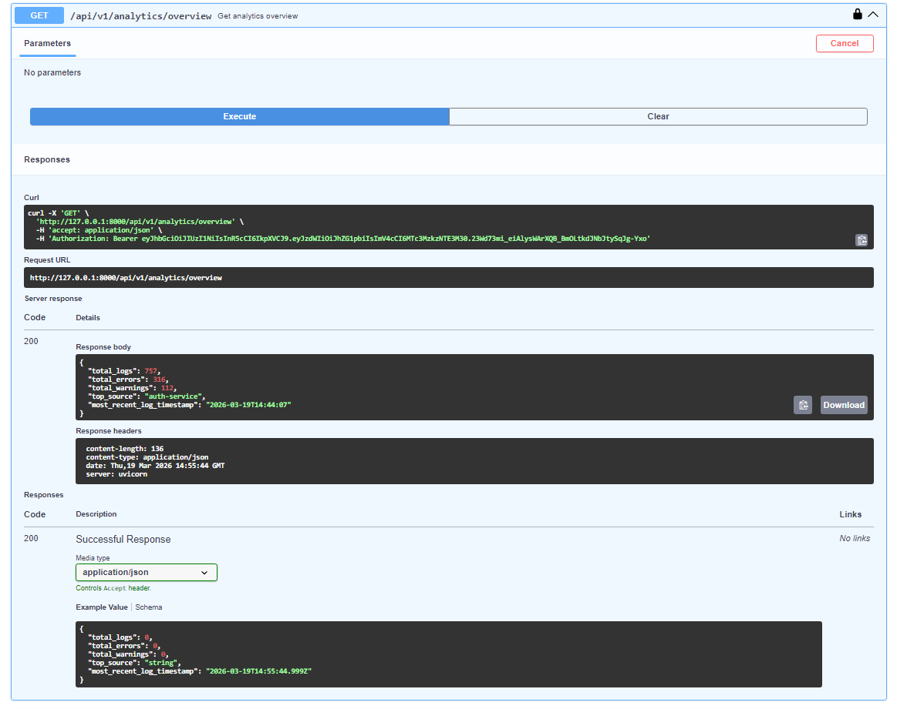
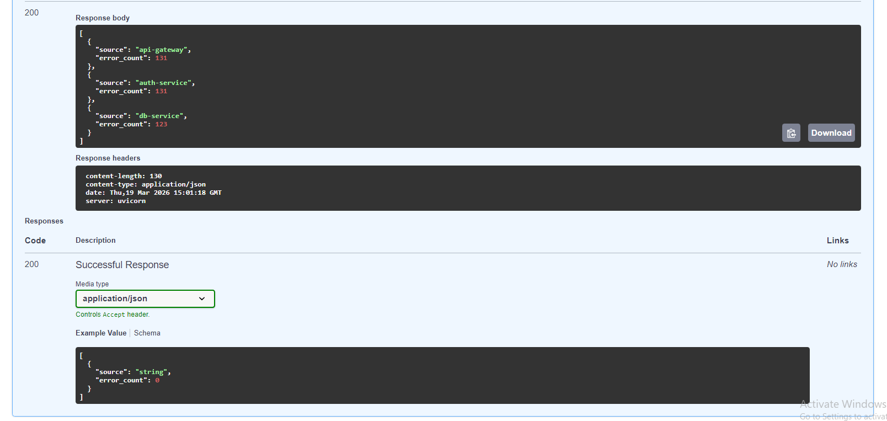
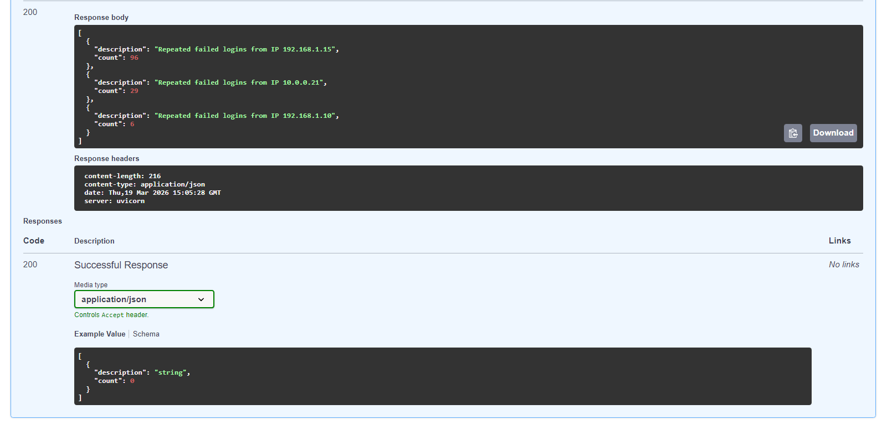

## Project Focus

This project focuses on backend API design and system architecture rather than security analysis or threat intelligence.

It is designed as a production-style REST API rather than a data science or dashboard tool.

# Log Analytics API

A production-style REST API built with **FastAPI** and **MySQL** for ingesting, querying, and analyzing operational log data from multiple services.

This project was designed to look and behave like a small real-world backend service rather than a tutorial CRUD app. It includes authentication, structured log storage, filtering, pagination, and analytics endpoints for monitoring trends and suspicious activity.

## Features

- JWT authentication for protected endpoints
- Log ingestion endpoint for creating new log records
- Log retrieval by ID
- Filtered log listing with pagination and sorting
- Analytics overview for high-level monitoring
- Severity distribution and source distribution
- Error trends over time
- Top failing services
- Error rate calculation
- Suspicious activity detection based on repeated failed logins
- Alembic migrations for database versioning
- Seed script for generating realistic demo data
- Pytest test coverage for core API functionality

## Tech Stack

- **Backend:** FastAPI, Python
- **Database:** MySQL
- **ORM:** SQLAlchemy
- **Migrations:** Alembic
- **Validation:** Pydantic
- **Authentication:** JWT
- **Testing:** Pytest

## Project Structure

```text
log-analytics-api/
│
├── app/
│   ├── api/
│   │   └── v1/
│   │       ├── endpoints/
│   │       │   ├── analytics.py
│   │       │   ├── auth.py
│   │       │   ├── health.py
│   │       │   └── logs.py
│   │       └── router.py
│   ├── core/
│   │   ├── config.py
│   │   └── security.py
│   ├── db/
│   │   ├── base.py
│   │   └── session.py
│   ├── models/
│   │   └── log_entry.py
│   ├── repositories/
│   │   └── log_repository.py
│   ├── schemas/
│   │   ├── analytics.py
│   │   ├── auth.py
│   │   └── log_entry.py
│   ├── services/
│   │   ├── auth_service.py
│   │   └── log_service.py
│   └── main.py
│
├── alembic/
├── scripts/
│   └── seed_data.py
├── tests/
├── assets/
├── README.md
└── requirements.txt
```

## API Endpoints

### Health
- `GET /api/v1/health`

### Authentication
- `POST /api/v1/auth/login`

### Logs
- `POST /api/v1/logs`
- `GET /api/v1/logs`
- `GET /api/v1/logs/{log_id}`

### Analytics
- `GET /api/v1/analytics/overview`
- `GET /api/v1/analytics/severity-distribution`
- `GET /api/v1/analytics/source-distribution`
- `GET /api/v1/analytics/error-trends`
- `GET /api/v1/analytics/top-failing-services`
- `GET /api/v1/analytics/error-rate`
- `GET /api/v1/analytics/suspicious-activity`

## Example Use Case

This API can be used as a lightweight backend service for:

- collecting logs from multiple internal services
- investigating repeated failed login attempts
- monitoring which services generate the most errors
- tracking how error volume changes over time
- reviewing overall system health through aggregated analytics

## Sample Login Request

```json
{
  "username": "admin",
  "password": "admin123"
}
```

## Sample Log Creation Request

```json
{
  "timestamp": "2026-03-19T12:30:00Z",
  "source": "auth-service",
  "host": "srv-auth-01",
  "severity": "ERROR",
  "message": "Failed login attempt for user admin",
  "environment": "prod",
  "event_type": "login_failed",
  "status_code": 401,
  "ip_address": "192.168.1.15",
  "user_id": "admin",
  "request_id": "req-12345"
}
```

## Sample Analytics Response

```json
{
  "total_logs": 757,
  "total_errors": 316,
  "total_warnings": 112,
  "top_source": "auth-service",
  "most_recent_log_timestamp": "2026-03-19T14:44:07"
}
```

## Screenshots

### Swagger Overview


### Analytics Overview


### Top Failing Services


### Suspicious Activity Detection


## How to Run Locally

### 1. Create and activate a virtual environment

```bash
python -m venv .venv
.venv\Scripts\activate
```

### 2. Install dependencies

```bash
pip install -r requirements.txt
```

### 3. Configure environment variables

Create a `.env` file in the project root based on `.env.example`.

### 4. Run database migrations

```bash
alembic upgrade head
```

### 5. Seed demo data

```bash
python scripts/seed_data.py
```

### 6. Start the API

```bash
uvicorn app.main:app --reload
```

Then open:

```text
http://127.0.0.1:8000/docs
```

## Testing

Run the test suite with:

```bash
pytest
```

## Design Notes

A few deliberate choices in this project:

- **MySQL** was used to model realistic relational log storage and aggregation queries.
- **JWT auth** was added to make the API feel closer to a real internal service.
- **Repository and service layers** were used to keep the codebase organized and easier to extend.
- **Seed data** was added so the analytics endpoints return meaningful results immediately.
- **Analytics endpoints** were prioritized over full CRUD because they make the project more valuable and more believable.

## Current Limitations

- Authentication uses a simple demo user rather than a full user management system.
- The project is designed for portfolio/demo use, not large-scale log streaming.
- Suspicious activity detection is heuristic-based and intentionally lightweight.
- Docker files may be included, but local setup is primarily documented for direct Python execution.

## Future Improvements

- Add bulk log ingestion
- Add time-range filters to analytics endpoints
- Add role-based access control
- Add export endpoints for reports
- Add dashboard frontend or charts layer
- Add containerized deployment setup when local environment allows

## Why I Built This

I built this project to practice backend API design, database modeling, authentication, and analytics-focused querying in a way that feels closer to a real monitoring service than a simple CRUD application.

## Author

**Slavcho Vlakeski**
